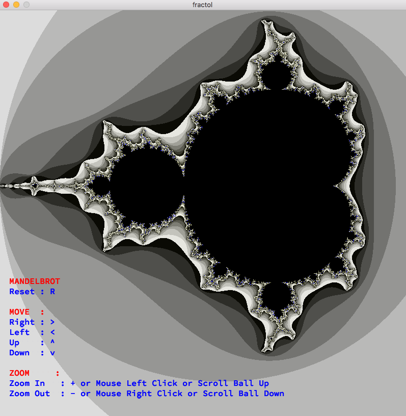
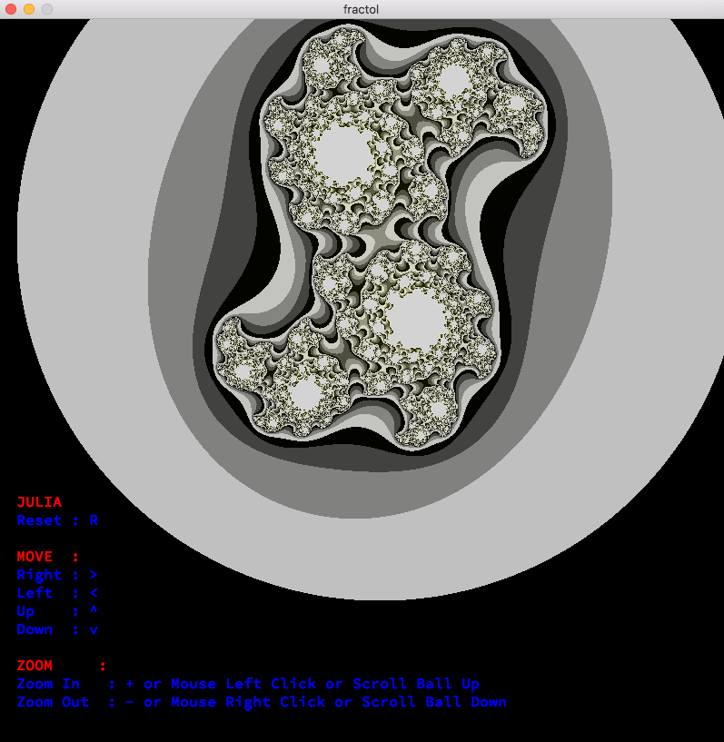

# Fractal


<br />
<br />
<br />


Fractal was created as school project.

Fractals are infinitely complex patterns that are self-similar across different scales. They are created by repeating a simple process over and over in an ongoing feedback loop.

## Prerequisites

All libraries are included

## Installing

Clone in your terminal :

```
git clone https://github.com/kmjaku/Fractal.git ~/Fractal
cd ~/Fractol
make
```

Launch Fractal :

```
you can replace 'example' in next step by 1, 2 or 3.  1 is for the Fractal of MandelBrot, 2 is for Julia and 3 is for BurninShip
./fractol [example]
```

Enjoy

### Clean

Clean your directories using available commands

Delete objects files

```
make clean
```

Delete binaries and libraries

```
make fclean
```

## Keyboard Shortcuts

The shortcuts are essential to move in the screen.

### Camera Controls

- <kbd>&uarr;</kbd> / <kbd>&darr;</kbd> camera moving up / down
- <kbd>&larr;</kbd> / <kbd>&rarr;</kbd> camera moving left / right
- <kbd>R</kbd> reset Fractal to initial position
- <kbd>+</kbd> / <kbd>-</kbd> zoom in / zoom out

## Contact & Copyright

Project done by [Kastriot Mjaku](https://www.linkedin.com/in/kastriot-mjaku-29b675a5/)
If you want to contact me, you can send me an email at kmjaku@student.42.fr

### Aknowledgments

* My thanks to the [42](http://www.42.fr/) school where I worked countless hours to finish this project.